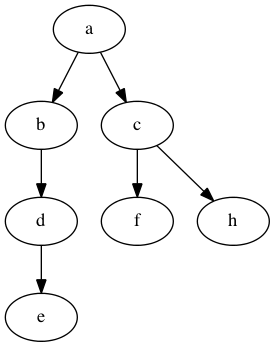

React Element Diff like Binary Tree Diff in Golang
==================

[](https://raw.githubusercontent.com/kkdai/react-diff/master/LICENSE)  [](https://godoc.org/github.com/kkdai/react-diff)  [](https://travis-ci.org/kkdai/react-diff)


Features
---------------

- Support React Element Diff (which only run `O(n)` on Tree diff)
- Support `three diff options`. 
- Support [Graphviz](http://www.graphviz.org/) tree display (Mac OSX only)

What is React Element Diff like Binary Tree Diff
---------------

It is a biary tree diff, which support three option: 

- `INSERT_MARKUP`: Diff and Insert node if current tree don't have this node.
- `MOVE_EXISTING`: Move node refer diff tree.
- `REMOVE_NODE`: Remove node if found node not exist in diff tree.

The diff rule refer to ["React Element Diff"](https://facebook.github.io/react/docs/glossary.html) and trying to modify some rul into tree diff.


Limitations
---------------

It has some limitation when we trying to apply element dif into tree diff.

- The tree must be binary tree (could be unsort)
- The diff most obey the diff option, otherwise diff result will be wrong.
- It take more memory space and run time to support three diff options.


Install
---------------
`go get github.com/kkdai/react-diff`


Usage
---------------

```go

package main

import (
	. "github.com/kkdai/react-diff"
)

func main() {
	nT := NewReactDiffTree(20)
	nT.InsertNote("a", 1)
	nT.InsertNote("b", 2)
	nT.InsertNote("c", 3)
	nT.InsertNote("d", 4)
	nT.InsertNote("f", 6)
	nT.InsertNote("e", 8)

	nT2 := NewReactDiffTree(20)
	nT2.InsertNote("a", 1)
	nT2.InsertNote("b", 2)
	nT2.InsertNote("c", 3)
	nT2.InsertNote("d", 5)
	nT2.InsertNote("h", 7)
	nT2.InsertNote("e", 10)

	nT.DiffTree(nT2, INSERT_MARKUP)
	nT.DisplayGraphvizTree()
}
```




Benchmark
---------------

```
BenchmarkAdd-4 	 1000000	      1229 ns/op
BenchmarkDel-4 	 5000000	       228 ns/op
BenchmarkGet-4 	   10000	    122375 ns/op
BenchmarkDiff-4	  300000	      4396 ns/op
```

Inspired
---------------

- [React 源码剖析系列 － 不可思议的 react diff](http://zhuanlan.zhihu.com/purerender/20346379)
- [React -Get Started](http://facebook.github.io/react/docs/getting-started.html)
- [React’s diff algorithm](http://calendar.perfplanet.com/2013/diff/)
- [React (Virtual) DOM Terminology](https://facebook.github.io/react/docs/glossary.html)

Project52
---------------

It is one of my [project 52](https://github.com/kkdai/project52).


License
---------------

This package is licensed under MIT license. See LICENSE for details.

